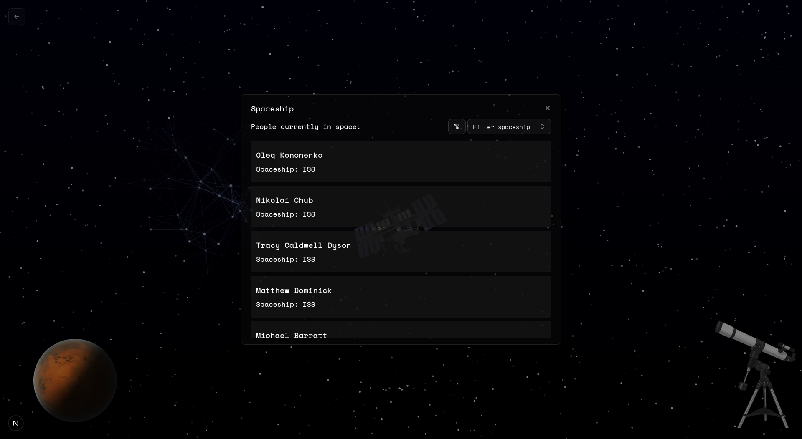

# Space Explorer

Explore information about space with easy to use, interactive site.

This Project is both api and web.



## **Functions:**

 - Pretty (in my opition) landing page
 - Interactive star background
 - Interactive button-images with modals
 - View people in space
 - Show NASA's picture of the day
 - Check weather on mars

## **Used Apis:**
 - [Open Notify](http://open-notify.org/) - people in space
 - [NASA APOD API](https://api.nasa.gov/planetary/apod) - picture of the day
 - [InSight: Mars Weather Service API](https://mars.nasa.gov/insight/weather/) - mars weather

## **Documentation:**

You can view all the enpoints that this api has [here](https://space.piernik.rocks/docs/scalar)

## **Technologies:**

I built this project's frontend partialy with [shadcn](https://ui.shadcn.com/) components

## Host it yourself:

You can host it by yourself with docker!

_If you want to use something different than traefik, you need to adjust compose file for your needs._

### Dependencies:

- [docker](https://docs.docker.com/engine/install/)
- [traefik](https://doc.traefik.io/traefik/getting-started/install-traefik/)

### Run:

#### First you need to create .env file in repo's root folder, this file is mounted inside docker container.

```bash
docker-compose up -d
```

## Development:

### Dependencies:

- [pnpm](https://pnpm.io/installation)
- [rust/cargo](https://rust-lang.org/tools/install/)
- [caddy](https://caddyserver.com/)
- [mongodb](https://www.mongodb.com/docs/manual/installation/)

### Run:

**web**

```bash
cd web/
pnpm i
pnpm dev
```

**api**

```bash
cd api/
cargo run
```

**caddy** - mixing api and web together on one port

```bash
caddy run
```
